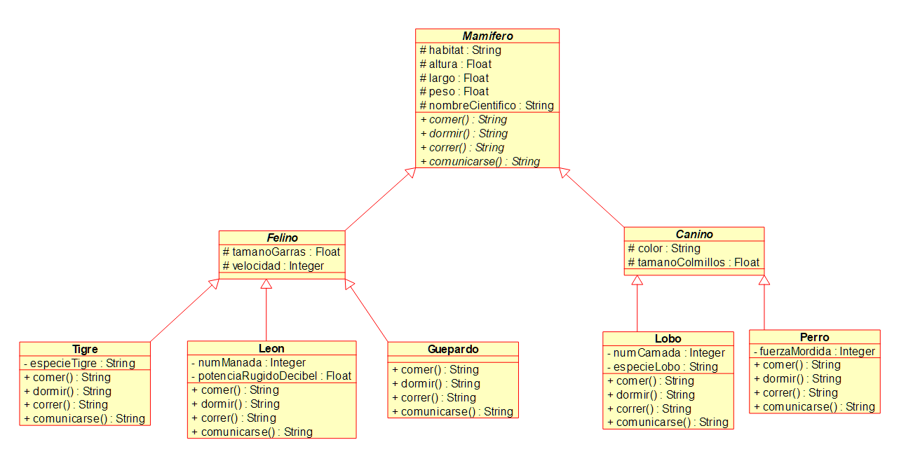

Se requiere escribir un programa para la administración de animales
de un zoológico, inicialmente para los mamíferos, para leones, 
lobos, tigres, guepardos y perros salvaje africano.

Se necesita diseñar una jerarquía de clases en común a todos ellos, 
por ejemplo para los felinos (Leon, Tigre y Guepardo) vamos a necesitar
la clase abstracta **Felino**, para los caninos (Lobo y Perro) 
vamos a necesitar la clase abstracta **Canino** y una clase que 
sea en común para todos ellos, la clase abstracta **Mamifero**.

Para todos los mamíferos mencionados se requieren de los 
siguientes atributos en común (que deberán de implementar 
en la clase abstracta Mamifero): el _habitat_ (string), _altura_ 
(decimal), _largo_ (decimal), _peso_ (decimal), _nombreCientífico_ 
(string) con sus respectivos métodos getters, usar constructor 
para inicializar los datos. También se necesitan 4 métodos 
abstractos que deberán implementar los tipos concretos: `comer()`, 
`dormir()`, `correr()`, `comunicarse()`, todos devuelven string.

Todos los caninos deberán tener además de lo anterior los atributos 
_color_ (string), _tamañoColmillos_ (decimal) e inicializar los datos 
mediante constructor con sus métodos getters.

Todos los felinos deberán tener los atributos _tamañoGarras_ 
(decimal) y _velocidad_ (int), inicializar los datos mediante 
constructor y sus métodos getters.

Respecto a los tipos concretos:

- El Leon además tiene númeroManada (int) y _potenciaRugido_ en decibel (decimal)
- El Tigre tiene el atributo _especieTigre_ (string)
- El Guepardo sin atributos adicionales
- El Lobo tiene _numeroDeCamada_ (int) y _especieLobo_ (string)
- El Perro tiene _fuerzaMordida_ en psi (int)

Los métodos abstractos `comer()`, `dormir()`, `correr()` y `comunicarse()`
tienen que ser implementados por las clases concretas devolviendo 
un string con alguna frase u oración que sea de acuerdo a cada tipo 
y que interactúe con sus atributos. No hay una regla para implementar 
estos métodos, pueden aplicar la creatividad, por ejemplo en la 
clase Leon el método `comer()` podría ser implementado devolviendo 
la cadena "El León caza junto a su grupo 
de " + _numManada_ + " individuos en las llanuras africanas", 
o para el Lobo el método dormir() devolver "El Lobo " + _color_ + " duerme 
en las cavernas de " + _habitat_.

Al final crear la clase con el método main llamada **EjemploMamiferos** 
y crear algunas instancias de ejemplo de cada clase concreta, entre 
5 a 7 objetos, asociado al tipo más genérico posible y mostrar los 
datos en consola. Por ejemplo:

`Mamifero[] mamiferos = new Mamifero[6];
`

`Mamifero guepardo = new Guepardo(4.9f, 130, "Africa", 94, 140, 72);
`

`mamiferos[0] = leon;
`

`mamiferos[1] = guepardo;
`

`for (Mamifero animal : mamiferos) { .... }`

Se deja el diagrama UML de clases como una guía, los métodos getters 
y constructores se omitieron para simplificar, pero deben ir 
en el código.

